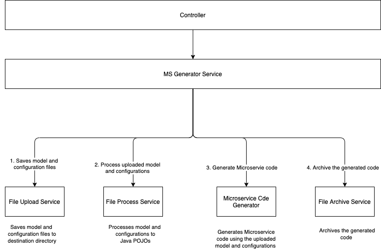
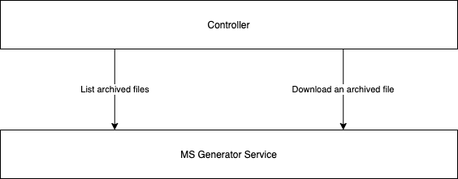

## Microservice Generator Service

### Functionality
This is REST service that generates microservice code. 

* It generates microservice code based on a model file (YAML).
* It also uses a configuration file (YAML) for database details (database username, password), actual service name.
* It uses Jinjava framework to generate microservice  java code
* After the code the generated, it archives the code. 

### Technical details

* The Microservice Generator Service generates java code.
* The generated code uses Spring Boot for microservice.
* It uses Spring JDBC Data for data persistence.
* It uses POSTGRES for data storage.
* It uses Flyway for database versioning.
* It applies Domain Driven Design Principles.

Domain Driven Design Principles
* One Aggregate per microservice
* A child entity can belong to only one aggregate

Service Endpoints
* Service offers 3 endpoints
* POST - Generate Microservice code - This endpoints accepts two files (YAMLS) models YAML and configurations YAML.
* GET - List all archived files
* GET - Download a given archived file

### Service Design

#### Generate Microservice Code

#### List and Download Archived Files

